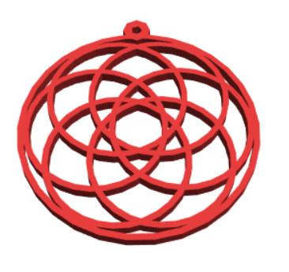

## Introduction

In this project, you will use BlocksCAD to design a 3D pendant. The pendant uses a geometric design based on the 'Flower of Life', a design which is often found in historical art. 

BlocksCAD is a 3D model editor that you can use in a web browser on a desktop computer or tablet. You drag and drop code blocks to design 3D models that can be exported for 3D printing.

If you have access to a 3D printer, then you can print your pendant. The pendant is small and only uses a little bit of filament, and it is quick to 3D print.

### What you will make

The finished pendant looks like this:

 

The pendant has a hoop on top so that you can put it on a necklace or cord. 

The pendant has a diameter of 40mm, plus the hoop for hanging. It is 2mm thick, so it will 3D print quite quickly.

After this project, you’ll also be able to code your own design and create a custom pendant. 

--- collapse ---
---
title: What you will need
---
### Hardware

+ A 3D printer, and filament in a colour of your choice
+ A necklace or cord to hang the pendant on

### Software

+ This project can be completed in a web browser using BlocksCAD [blockscad3d.com/editor](https://www.blockscad3d.com/editor){:target="_blank"}

--- /collapse ---

--- collapse ---
---
title: What you will learn
---

+ How to use `count` loops to create geometric patterns
+ How to use `difference` blocks to create hoops from cylinders

--- /collapse ---

--- collapse ---
---
title: Additional information for educators
---

If you need to print this project, please use the [printer-friendly version](https://projects.raspberrypi.org/en/projects/blockscad-pendant/print){:target="_blank"}.

Download the finished project code at:
[http://rpf.io/p/en/blockscad-pendant](http://rpf.io/p/en/blockscad-pendant).

--- /collapse ---
