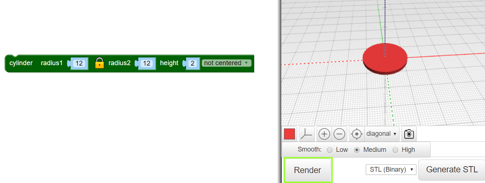
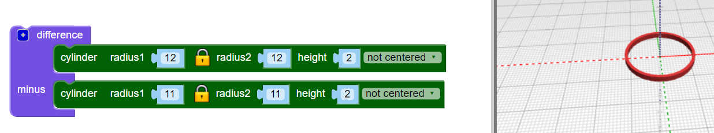

## Create a hoop

The design uses six interlocking hoops in the centre, and a larger hoop around the outside. The pendant is 4cm wide, plus the hoop for hanging. It is 2mm thick, so it will 3D print quite quickly.

First, make a single inner hoop. 

--- task ---
Open the BlocksCAD editor in a web browser [blockscad3d.com/editor/](https://www.blockscad3d.com/editor/){:target="_blank"}.

You can drag and drop blocks to write code to create 3D objects. 

--- /task ---
--- task ---
Create a `cylinder` with a radius of `12` and a height of `2` (the unit here is millimetres). 

 
	
`Cylinders` are automatically centred along the X and Y axes. Select `not centered` so that the pendant sits on the surface. (This means that the Z axis value is larger than 0).
	
Click on the **Render** button after each change to your code to see the results. 

--- /task ---
--- task ---
Now, use `difference`{:class="blockscadsetops"} to remove a smaller `cylinder` from the centre. This creates a hoop:

 
	
If you like, you can click on the coloured square to change the colour used in the viewer. This does not affect the colour of your pendant, as that depends on the colour of the filament that you use. 
	
--- /task ---
	
	
