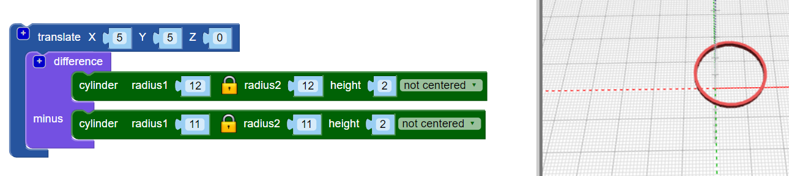
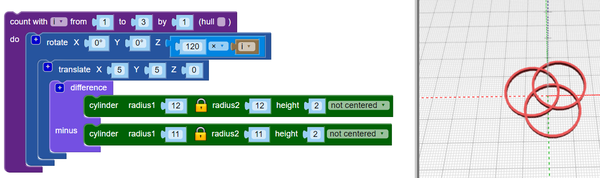
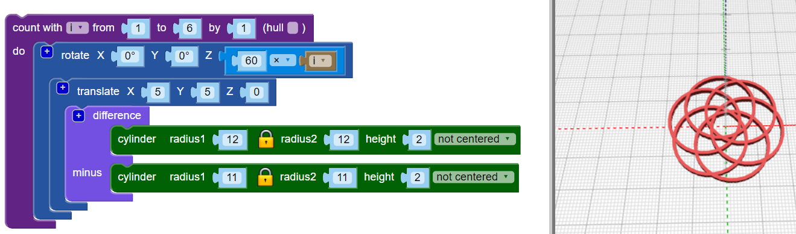

## Develop - Repeat the shapes

The design uses six intersecting hoops, and each hoop is moved out from the centre and rotated a different number of degrees. 

--- task ---

In the final design, there is no central hoop: the hoops are all moved out from the centre.

First, `translate`{:class="blockscadtransforms"} (move) the first hoop into position. 
	
 
	
Now the hoop is a little off-centre. 

--- /task ---

--- task ---

You need multiple copies of this hoop, rotated around the centre. First, create three equally spaced hoops:

Add a `count`{:class="blockscadloops"} loop to create three hoops. To space the hoops, add a `rotate`{:class="blockscadtransforms"} block between the `count` loop and the `translate` block. `Count` sets the `i` variable from 1 to 3. `Rotate` moves each hoop by `120 × i` degrees, so the the three hoops are distributed equally around the 360 degrees of a circle (360 / 3 = 120).

 

Look at the code and make sure you understand how it works. 

--- /task ---

--- task ---

The finished design has six hoops rather than three. Change your code so that it creates six equally spaced hoops.

--- hints ---

--- hint ---

Change the `count`{:class="blockscadloops"} loop so that it runs six times instead of three. The six hoops will need to be equally spaced around 360 degrees. 

--- /hint ---

--- hint ---
You need to change the loop to run from 1 to 6 and move in multiples of 60 degrees (360 / 6 = 60):

--- /hint ---

--- hint ---

Your code should look like this:

 

--- /hint ---

--- /hints ---

--- /task ---	
	
