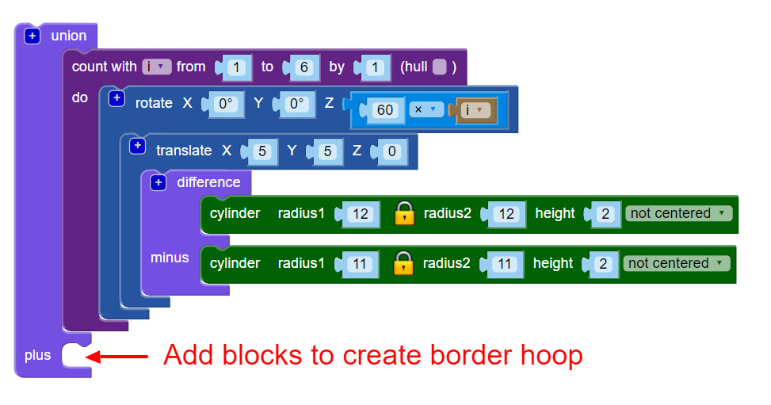
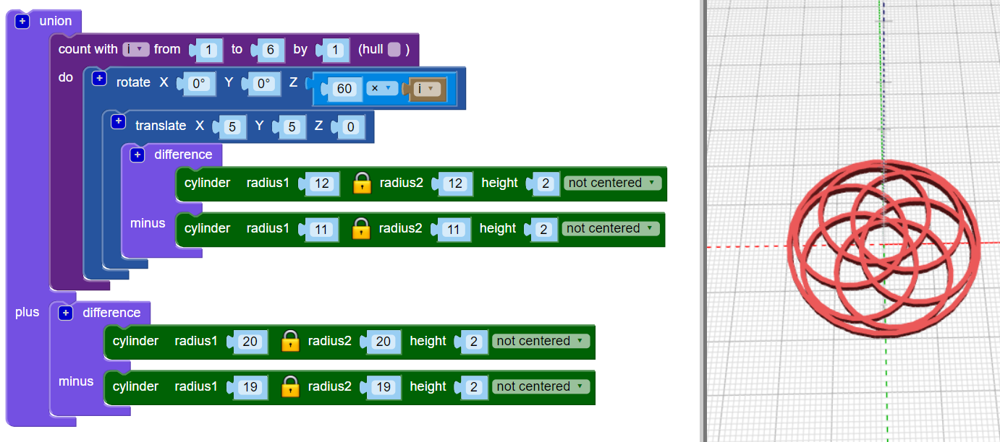

## Develop - Add a border

Next, add a border around the edge of the design. 

 

--- task ---

Create a centred hoop that touches the edges of the design. You can either do the maths to work out what the radius of the circle needs to be, or you can just create a circle and change the radius until it works. Either approach is fine!

Use the `union`{:class="blockscadsetops"} block to join the border to the other hoops:
	
 

--- hints --- 

--- hint ---
Use the `cylinder` and `difference` blocks to make the hoop. 

The six hoops each have a radius of 12mm, so the border cylinder that you are making needs to be bigger than that. You could try setting the radius to 24mm. 

To make a hoop, the radius of the second `cylinder` in the `difference` block needs to be 1mm smaller than the radius of the first `cylinder`. 

--- /hint ---

--- hint ---
Adjust the size of the `cylinders` until the border hoop just touches the outer edges of the six inner hoops. 

--- /hint ---

--- hint ---

The radius should be around `20`. (In the introduction, it said that the finished pendant will be 40mm in diameter!)

	
You could also use maths to work out the diameter. 

The diameter of each inner hoop is 24mm. If the hoops met at the centre of the pendant, then the border hoop would need to have a radius of 24mm. But the inner hoops overlap, because they are translated 5mm along the X and Y axes. 

This removes a section from the radius. This section is on the arc, 5mm from the origin, so we know that we need to remove 5mm from 24mm. This means that the inner radius of the border hoop should be 19mm. 

Maths is really useful when you need to be accurate. But it's fine to just change things until you get the result you need. 

--- /hint ---

--- /hints --- 

--- /task ---
