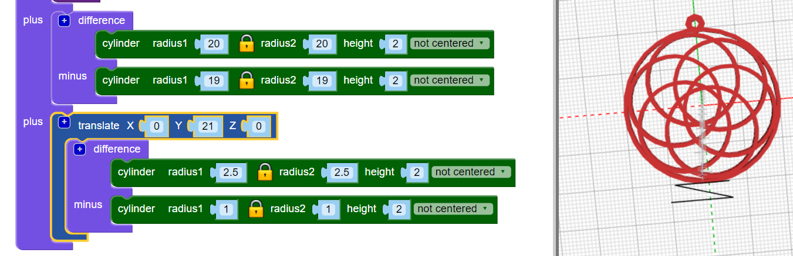
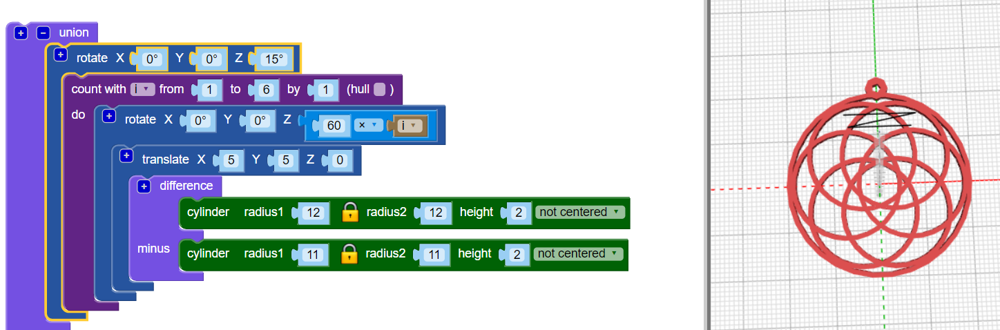

## Add a hanging hoop

Now, add a small hanging hoop through which you can thread a cord to make a necklace. 

Tip: This code adds a small hoop that can be used with elastic necklace thread. If you have a bigger cord or chain, you can adapt the code to create a bigger hanging hoop. 
	
--- task ---
Add a small hanging hoop that you can put a thread through. 

Click the `[+]` on the `union` block to add another section. 
	
 
	
At the moment, the position of the hanging hoop isn't very visually pleasing.  

--- /task ---
--- task ---
Add a `rotate`{:class="blockscadtransforms"} block to move the inner hoops so that the hanging hoop is centred over one of the gaps between them. 

 
	
--- /task ---	

	
